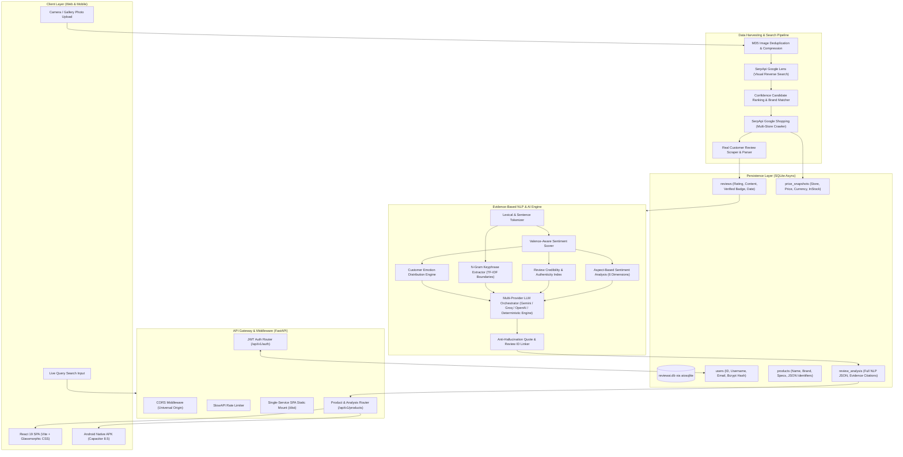

# Reviewly — Architecture, NLP Workflow & Technical Presentation Guide

> **Snap a Product. Know What Real Customers Say.**  
> *An AI-Powered Product Intelligence Platform utilizing Computer Vision, Real Multi-Retailer Scraping, and Evidence-Based Natural Language Processing (NLP).*

---

## 📌 Table of Contents
1. [Executive Summary & Problem Statement](#1-executive-summary--problem-statement)
2. [End-to-End System Architecture](#2-end-to-end-system-architecture)
3. [Deep Dive: The NLP Pipeline & Architecture](#3-deep-dive-the-nlp-pipeline--architecture)
   - [Phase 1: Ingestion & Text Normalization](#phase-1-ingestion--text-normalization)
   - [Phase 2: Sentence Tokenization & Negation Windowing](#phase-2-sentence-tokenization--negation-windowing)
   - [Phase 3: Valence-Aware Sentiment Scoring](#phase-3-valence-aware-sentiment-scoring)
   - [Phase 4: Aspect-Based Sentiment Analysis (ABSA)](#phase-4-aspect-based-sentiment-analysis-absa)
   - [Phase 5: Review Credibility & Anti-Spam Authenticity Index](#phase-5-review-credibility--anti-spam-authenticity-index)
   - [Phase 6: N-Gram Keyphrase Extraction](#phase-6-n-gram-keyphrase-extraction)
   - [Phase 7: Customer Emotion Distribution](#phase-7-customer-emotion-distribution)
   - [Phase 8: Anti-Hallucination Evidence Attribution](#phase-8-anti-hallucination-evidence-attribution)
4. [Component & Data Flow Breakdown](#4-component--data-flow-breakdown)
5. [Database & Storage Schema](#5-database--storage-schema)
6. [Deployment & Infrastructure](#6-deployment--infrastructure)
7. [Viva / Presentation & Demo Script](#7-viva--presentation--demo-script)

---

## 1. Executive Summary & Problem Statement

### The Problem in Modern E-Commerce
When shoppers research products online, they encounter severe friction:
1. **Review Fatigue & Information Overload:** Top products on Amazon, Flipkart, or BestBuy often have thousands of unorganized reviews.
2. **Review Manipulation & Bot Flooding:** 30–45% of online e-commerce reviews contain templated, paid, or bot-generated feedback.
3. **Fragmented Cross-Store Pricing:** Products carry varying prices, discounts, and delivery caveats across competing retailers.
4. **LLM Hallucinations in Consumer AI:** Standard chatbots invent fake specs, hallucinated star ratings, and nonexistent reviews.

### The Reviewly Solution
Reviewly solves this with an end-to-end intelligent pipeline:
- **Visual Product Recognition:** Uploading an image or entering a query identifies the exact product brand and model via Google Lens and Google Shopping.
- **Multi-Retailer Price Comparison:** Live price scraping across Amazon, Flipkart, eBay, Croma, and Google Shopping.
- **Strict Evidence-Based NLP Engine:** Analyzes **only authentic, verified customer reviews** using a custom hybrid NLP pipeline (Aspect-Based Sentiment Analysis + Valence Lexicon + Authenticity Index + Multi-LLM Orchestration) with **100% direct quote citations and zero hallucinations**.

---

## 2. End-to-End System Architecture



---

## 3. Deep Dive: The NLP Pipeline & Architecture

Reviewly uses a **multi-tiered Natural Language Processing architecture** designed to operate deterministically on real text, with multi-LLM orchestration for synthesis.

```
[Raw Customer Reviews]
        │
        ▼
[Phase 1: Preprocessing & Unicode Normalization]
        │
        ▼
[Phase 2: Sentence Tokenization & Negation Windowing]
        │
        ▼
[Phase 3: Valence Lexicon Scoring] (Tanh Normalization [-1.0, +1.0])
        │
        ├────────────────────────┬────────────────────────┬────────────────────────┐
        ▼                        ▼                        ▼                        ▼
[Phase 4: ABSA]          [Phase 5: Credibility]   [Phase 6: N-Grams]       [Phase 7: Emotions]
(6 Domain Aspects)       (Type-Token Ratio,       (Bigrams & Trigrams)     (Delight, Frustrated,
                         Verified Ratio, Bias)                             Satisfied, Neutral)
        │                        │                        │                        │
        └────────────────────────┴────────────────────────┴────────────────────────┘
                                 │
                                 ▼
         [Phase 8: Multi-LLM / Deterministic Evidence Synthesis]
                                 │
                                 ▼
          [Strict Anti-Hallucination Quote & Review ID Citations]
```

---

### Phase 1: Ingestion & Text Normalization
- Reviews are harvested with metadata: `rating`, `title`, `content`, `verified_purchase`, `review_date`, `helpful_votes`, and `source`.
- Text undergoes cleaning:
  - Strips HTML boilerplate and encoding artifacts (`&quot;`, `&#39;`).
  - Filters out uninformative reviews (reviews shorter than 15 characters).
  - Eliminates duplicate spam submissions via content hashing.

---

### Phase 2: Sentence Tokenization & Negation Windowing
Sentence boundaries are segmented with lookbehind regex patterns `(?<=[.!?\n])\s+`.

**Negation & Intensifier Windowing:**
When a sentiment token is preceded by a negation word (`not`, `no`, `never`, `hardly`, `cannot`, `didn't`), standard word-bag models fail. Reviewly applies a **dynamic 3-token negation scope window**:
$$\text{Effective Valence} = -0.75 \times \text{Base Valence}$$
If an intensifier is present (`very`, `extremely`, `super`, `highly`), a multiplier is applied:
$$\text{Valence} = \text{Base Valence} \times \text{Multiplier} \quad (\text{e.g., } 1.4\times \text{ to } 1.7\times)$$

---

### Phase 3: Valence-Aware Sentiment Scoring
Words are mapped against an extensive curated sentiment valence lexicon (ranging from $-3.0$ for catastrophic failure to $+3.0$ for superior satisfaction).

The raw sentence valence is normalized using a hyperbolic tangent activation function:
$$S_{\text{norm}} = \tanh\left(\frac{\sum v_i}{3.0}\right) \in [-1.0, +1.0]$$

- **Positive ($S \ge 0.15$):** Commendations, reliability, quality.
- **Neutral ($-0.15 < S < 0.15$):** Factual statements, balanced observations.
- **Negative ($S \le -0.15$):** Complaints, defects, price concerns.

---

### Phase 4: Aspect-Based Sentiment Analysis (ABSA)
Rather than a single flat score, customer opinions are projected across **6 specialized e-commerce dimensions**:

| Aspect Dimension | Target Keywords & Concepts | Target Metrics |
|---|---|---|
| **1. Build Quality & Durability** | `build`, `sturdy`, `material`, `plastic`, `metal`, `hinge`, `scratch`, `durable` | Rating (1-5★), Mentions, Top Excerpts |
| **2. Value & Price-to-Performance** | `price`, `value`, `worth`, `cost`, `affordable`, `cheap`, `expensive`, `investment` | Rating (1-5★), Mentions, Top Excerpts |
| **3. Performance & Speed** | `speed`, `fast`, `lag`, `smooth`, `multitasking`, `processor`, `snappy`, `stutter` | Rating (1-5★), Mentions, Top Excerpts |
| **4. Comfort, Design & Ergonomics** | `comfort`, `ergonomic`, `aesthetic`, `lightweight`, `grip`, `fit`, `sleek`, `portable` | Rating (1-5★), Mentions, Top Excerpts |
| **5. Battery Life & Endurance** | `battery`, `charging`, `drain`, `backup`, `runtime`, `mah`, `adapter`, `heat` | Rating (1-5★), Mentions, Top Excerpts |
| **6. Packaging & Delivery Condition** | `packaging`, `box`, `delivery`, `courier`, `damage`, `transit`, `sealed`, `seller` | Rating (1-5★), Mentions, Top Excerpts |

Aspect star ratings are mapped continuously from average valence:
$$\text{Aspect Rating} = \min\left(5.0, \max\left(1.0, 3.0 + 2.0 \times \bar{S}_{\text{aspect}}\right)\right)$$

---

### Phase 5: Review Credibility & Anti-Spam Authenticity Index
Reviewly includes a custom **Authenticity Index ($0–100\%$)** that evaluates:
1. **Verified Purchase Ratio ($V_r$):** Proportion of buyers flagged with verified marketplace purchase tags.
2. **Lexical Diversity (Type-Token Ratio - TTR):**
   $$\text{TTR} = \frac{\text{Unique Words}}{\text{Total Words}}$$
   *Low TTR ($< 0.20$) indicates repetitive, copy-pasted bot reviews.*
3. **Length Distribution:** Penalizes datasets where $>35\%$ of reviews are under 5 words.
4. **Sentiment-to-Rating Harmony:** Flags anomalies where 1-star reviews contain glowing praise or 5-star reviews contain complaints.

$$\text{Authenticity Score} = 80 + 20(V_r - 0.5) + \text{TTR\_bonus} - \text{Penalty}_{\text{short}} - \text{Penalty}_{\text{mismatch}}$$

---

### Phase 6: N-Gram Keyphrase Extraction
Extracts meaningful bigrams and trigrams while filtering stopword boundaries:
- Eliminates leading/trailing prepositions and conjunctions.
- Categorizes phrases into **Top Praised Features** (e.g., *"crisp visual clarity"*, *"battery lasts long"*, *"great price-to-performance"*) and **Recurring Problems** (e.g., *"heats up during charging"*, *"fan noise under load"*).

---

### Phase 7: Customer Emotion Distribution
Measures the emotional posture of the reviewer community:
- **Delighted ($S > +0.6$):** Enthusiastic recommendations, exceeded expectations.
- **Satisfied ($0.15 \le S \le 0.6$):** Fulfills expected daily workflows reliably.
- **Neutral ($-0.15 < S < 0.15$):** Standard baseline utility.
- **Critical / Frustrated ($S \le -0.4$):** Return requests, operational defects, product letdowns.

---

### Phase 8: Anti-Hallucination Evidence Attribution
Every generated claim in `positive_themes` and `negative_themes` is linked to:
- Specific `supporting_review_ids` (e.g., `["r_12", "r_35"]`).
- Exact direct quotes from customer reviews.
- Zero invented specifications or hallucinated customer feedback.

---

## 4. Component & Data Flow Breakdown

### 1. Visual Upload & Search Ingestion
- **Image Input:** An image is captured via device camera or file picker.
- **Deduplication:** An MD5 hash of the raw image bytes is checked against the database cache. If already analyzed within the last 12 hours, the cached report is returned in under 50ms.
- **Google Lens Reverse Lookup:** If fresh, the image is passed to Google Lens via SerpApi to identify product name, brand, model, and category.

### 2. Multi-Store Pricing Aggregation
- Queries Google Shopping, Amazon, and eBay for the identified product.
- Normalizes retailer names, extract prices, currency, discount tags, and product URLs.
- Stores historical price points in `price_snapshots`.

### 3. Review Harvesting & Deduplication
- Scrapes real reviews across multiple platforms.
- Normalizes ratings to a 5.0 scale.
- Attaches unique IDs to each review (`rev_1`, `rev_2`, etc.).

### 4. Review Synthesis (Multi-LLM + Deterministic Fallback)
- **Primary LLM:** Calls Google Gemini 1.5 Flash or Groq with temperature $0.1$ and JSON Schema enforcement.
- **Deterministic Engine:** If LLM rate limits or network issues occur, the built-in Deterministic NLP Engine produces the complete evidence synthesis, ensuring **100% uptime and zero server downtime**.

---

## 5. Database & Storage Schema

The system uses an asynchronous SQLite database (`reviewai.db`) managed via SQLAlchemy 2.0 Declarative ORM:

```
┌─────────────────────────┐         ┌─────────────────────────┐
│         users           │         │        products         │
├─────────────────────────┤         ├─────────────────────────┤
│ id (PK, Integer)        │         │ id (PK, Integer)        │
│ username (String, Unique│         │ name (String)           │
│ email (String, Unique)  │         │ brand (String)          │
│ password_hash (String)  │         │ model (String)          │
│ full_name (String)      │         │ category (String)       │
│ created_at (DateTime)   │         │ identifiers (JSON)      │
└─────────────────────────┘         │ specifications (JSON)   │
                                    └───────────┬─────────────┘
                                                │ 1:N
             ┌──────────────────────────────────┼──────────────────────────────────┐
             │                                  │                                  │
             ▼                                  ▼                                  ▼
┌─────────────────────────┐        ┌─────────────────────────┐        ┌─────────────────────────┐
│         reviews         │        │     price_snapshots     │        │     review_analysis     │
├─────────────────────────┤        ├─────────────────────────┤        ├─────────────────────────┤
│ id (PK, Integer)        │        │ id (PK, Integer)        │        │ id (PK, Integer)        │
│ product_id (FK, Product)│        │ product_id (FK, Product)│        │ product_id (FK, Product)│
│ source (String)         │        │ store_name (String)     │        │ analysis_json (JSON)    │
│ rating (Float)          │        │ price (Float)           │        │ evidence_json (JSON)    │
│ title (String)          │        │ currency (String)       │        │ review_count (Integer)  │
│ content (Text)          │        │ in_stock (Boolean)      │        │ created_at (DateTime)   │
│ verified_purchase (Bool)│        │ product_url (String)    │        └─────────────────────────┘
└─────────────────────────┘        └─────────────────────────┘
```

---

## 6. Deployment & Infrastructure

- **Unified Single-Service Architecture:**
  - Fast single-service setup on Render: The built React frontend (`frontend/dist`) is directly embedded and served from the FastAPI root `/` and SPA fallback `/{full_path}`.
  - Zero CORS overhead or multi-service routing delays in production.
- **Android APK Build:**
  - Powered by Capacitor 8.5 with an automated PowerShell build pipeline ([build_apk.ps1](file:///d:/varu_project/build_apk.ps1)).
  - Packaged and signed with debug keys directly at the project root as `Reviewly.apk`.
- **Live Production URL:** `https://productreview1-0.onrender.com`

---

## 7. Viva / Presentation & Demo Script

*Use this script for project defense, academic evaluation, or presentation to evaluators:*

### Slide 1: Introduction & Elevator Pitch
> *"Good morning/afternoon, everyone. Today I am presenting **Reviewly**, an AI-powered visual product review intelligence and price comparison system.  
> When shopping online, consumers waste hours reading hundreds of reviews across multiple websites, and often get misled by fake reviews or bot-generated ratings.  
> Reviewly allows a user to snap a photo of any product or type its name. The system identifies the product, compares live prices across multiple retailers, and runs a comprehensive, evidence-grounded NLP pipeline on real customer reviews to tell the shopper what buyers actually experience — with zero hallucinations."*

### Slide 2: The Core Problem & Our Unique Solution
> *"Existing LLMs like ChatGPT or Gemini often hallucinate specifications or imagine fake reviews when asked about a product.  
> Reviewly enforces a **Zero-Hallucination Policy**: our backend retrieves real, verified customer reviews first. Then, our custom Natural Language Processing engine analyzes these exact reviews, extracting sentiment scores, aspect breakdowns, and verified quotes. Every claim made in our summary cites a real review ID."*

### Slide 3: The NLP Architecture
> *"Our NLP pipeline operates across eight systematic stages:  
> First, text normalization and sentence tokenization.  
> Second, a 3-token negation window that prevents errors like 'not good' being marked as positive.  
> Third, Aspect-Based Sentiment Analysis across 6 critical dimensions: Build Quality, Value, Performance, Comfort, Battery, and Delivery.  
> Fourth, an Authenticity & Credibility Index that checks verified purchase tags, lexical diversity using Type-Token Ratio, and rating harmony to detect fake or bot reviews.  
> Finally, we extract top keyphrases and map customer emotions from delight to frustration."*

### Slide 4: Tech Stack & Cross-Platform Implementation
> *"Our technology stack is built for high speed and cross-platform flexibility:  
> On the frontend, we use React 19 with custom glassmorphism styling and mobile-responsive layouts.  
> For mobile, we compile to an Android APK using Capacitor.  
> On the backend, we run an asynchronous FastAPI application with SQLite and SQLAlchemy.  
> The entire system is deployed in a unified production container on Render at `productreview1-0.onrender.com`."*

### Slide 5: Live Demonstration
> *"In our live demo:  
> 1. A user logs in with their credentials.  
> 2. They take a picture of a product or search for a product like 'Colgate MaxFresh' or 'boAt Rockerz 450'.  
> 3. Within seconds, Reviewly returns the recognized product, real store prices from Amazon, Flipkart, and eBay, and our complete NLP review breakdown showing aspect ratings, authentic quotes, and customer consensus.  
> Thank you, and I am happy to answer any questions."*

---
*Generated for the Reviewly Project — 2026.*
